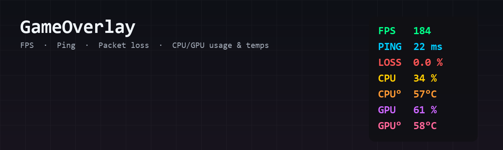

# GameOverlay



A lightweight, fully customisable in-game performance overlay for Windows.

Shows, in an always-on-top click-through overlay:

- **FPS**, plus **1% low** and **0.1% low** FPS (via Intel PresentMon, bundled) — the
  lows are derived from real frame times and reveal stutter that average FPS hides
- **Ping** and **packet loss** (to any host you choose — your game server IP or 1.1.1.1)
- **CPU usage** and **CPU temperature**
- **GPU usage** and **GPU temperature** (AMD, NVIDIA and Intel GPUs, via LibreHardwareMonitor)

Every metric has its own **on/off toggle** and **colour picker**. You can also change the
**screen position** (top left / top centre / top right / centre / bottom corners, etc.),
font, font size, opacity, and toggle the background box.

## Download

From the [latest release](../../releases/latest), pick one:

- **GameOverlay.exe** — single file, just run it. Most convenient.
- **GameOverlay-folder.zip** — unzip and run `GameOverlay.exe` inside. **Use this one if
  your antivirus flags the single-file exe** (see below) — this build does not self-extract,
  so it trips far fewer scanners.

> **First run notes**
> - Windows SmartScreen may warn about an unknown publisher: click **More info → Run anyway**.
> - The app asks for **administrator access** (UAC prompt). This is required to read CPU
>   temperature sensors and to capture FPS — decline it and those metrics show `--`.

### Antivirus false positives

The single-file exe is built with PyInstaller and is **not signed** (code-signing
certificates cost money). Some antivirus / VPN "threat protection" tools flag unsigned
self-extracting exes by heuristic — it is a **false positive**, and the entire source is
in this repo so you can verify it. If your AV blocks or deletes the download, in order of
easiest first:

1. **Use `GameOverlay-folder.zip`** instead of the single exe — the onedir build does not
   self-extract and is flagged far less often.
2. **Add an exclusion** for the file/folder in your antivirus or VPN threat-protection
   settings, and restore it from quarantine.
3. **Run from source** — no packed exe at all, so there is nothing to flag. Download this
   repo (green *Code* button → *Download ZIP*), install
   [Python 3.10+](https://www.python.org/downloads/) (tick *Add python.exe to PATH*), then
   double-click **`run_from_source.bat`**.

## Usage

1. Run `GameOverlay.exe`. A settings window opens and the overlay appears.
2. Tick/untick metrics, click the colour squares to recolour them, pick a position.
   All changes apply instantly and are saved to `%APPDATA%\GameOverlay\config.json`.
3. Start your game. FPS locks onto whatever game window is in the foreground.
4. Minimise the settings window while playing. **Hide overlay** temporarily hides it;
   **Quit** (or closing the settings window) exits.

### Important: fullscreen mode

Like most external overlays, it **cannot draw over exclusive-fullscreen games**.
Set your game's display mode to **Borderless / Windowed Fullscreen** (looks identical,
and is the default in most modern games). FPS capture works in any mode.

### Ping

In **Auto** mode (the default) the overlay finds the server your game is actually
connected to: it looks up the game's local UDP ports, samples 2 seconds of real network
traffic (Windows doesn't expose UDP remote addresses any other way), and pings whichever
public address the game is exchanging the most packets with. The ping therefore changes
when you switch servers/regions. If a server ignores pings (some block ICMP), the overlay
automatically tries the game's other remote addresses.

FPS, ping and loss all show `--` whenever you're not actively in a game — same as FPS,
auto-mode ping only ever probes a server while it can see you're connected to one, so it
never pings some unrelated address in the background. If you want a ping reading even
when you're not in a game, switch to a fixed **Custom host** in Settings → Network (that
mode always pings the address you enter). Packet loss is measured over the last ~50
pings, once at least 10 have been collected. The status bar in the settings window shows
exactly which address is being pinged.

## Running from source

```
pip install psutil
python overlay.py
```

Requires Python 3.10+ on Windows. The `bin\` folder (PresentMon, sensor helper and DLLs)
must sit next to `overlay.py` — it's included in the repo.

## Building the exe

```
build.ps1
```

This creates a venv, installs PyInstaller, and produces `dist\GameOverlay.exe`.

## How it works

- `overlay.py` — tkinter overlay (frameless, transparent, click-through via
  `WS_EX_TRANSPARENT`) plus the settings window and worker threads.
- `hwmon\HardwareMonitor.cs` — tiny C# helper compiled against
  [LibreHardwareMonitor](https://github.com/LibreHardwareMonitor/LibreHardwareMonitor);
  prints CPU/GPU sensor JSON once a second. Compiled with the `csc.exe` that ships with
  Windows, so no .NET SDK is needed.
- FPS comes from [Intel PresentMon](https://github.com/GameTechDev/PresentMon): every CSV
  row it emits is one presented frame, and its `MsBetweenPresents` column is that frame's
  time. Average FPS is frames-per-second over a 2 s window; the **1% / 0.1% lows** are
  `1000 / p99` and `1000 / p99.9` of the frame times over a 60 s window — i.e. the frame
  rate during your worst 1% (and worst 0.1%) of frames, which is what stutter feels like.

## Licence

MIT. Bundles LibreHardwareMonitorLib (MPL 2.0) and Intel PresentMon (MIT).
